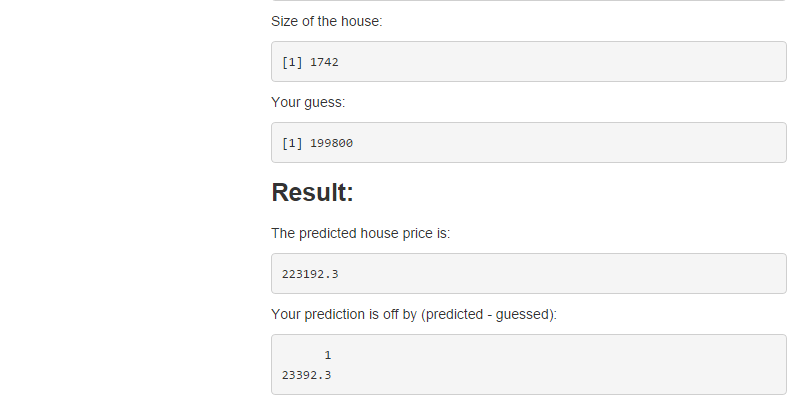

ShinyApp: Guess the House Price!
========================================================
author: Yilun Zhang
date: November 16 2014

<small>
Statistics and Computational Mathematics  
Univesity of Waterloo  
E: yl5zhang@uwaterloo.ca  
T: +1 (519) 998-3545  
</small>

Introduction
========================================================

This shiny app is design for people to estimate the house price by providing the following criteria:

- **Number of bedroom**
- **Number of bathroom**
- **New or old**
- **Size of the house**

It also allows users to input their estimated price and compared to the predicted price from the collected set of data.

The Data
========================================================


Below is the head of the data that is being used to predict the house price in this application.


```r
head(data)
```

```
  Beds Baths New  Price Size
1    4     2   0 279900 2048
2    2     1   0 146500  912
3    4     2   0 237700 1654
4    3     2   0 200000 2068
5    3     3   0 159900 1477
6    3     2   1 499900 3153
```
In the data, "Beds", "Baths" and "New" are the categorical variables, and "Size" is numerical.
"Price" is the depended variable.

ShinyApp Interface - Input
========================================================


ShinyApp Interface - Output
========================================================


<small style="font-size:.7em">
After clicing the button, the App will use your input information to predict the house price and return the expected value and it will also show you the difference between the expected value and your guess price.

Isn't it nice?

Try it out at: [http://yilunzhang.shinyapps.io/ShinyApps-Project](http://yilunzhang.shinyapps.io/ShinyApps-Project)
